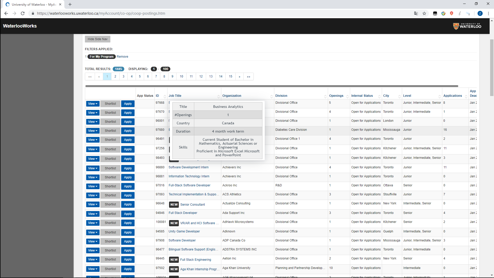
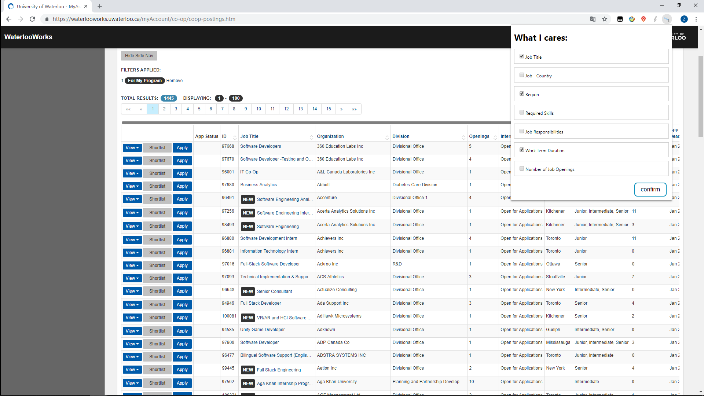
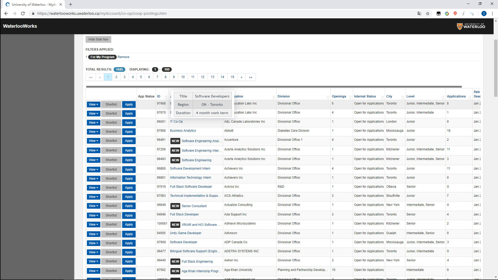

# WaterlooWorksSkimmer

A chrome extension helps see the brief information of work experiences just by hovering mouse over the work id instead of opening whole web page of the work.

## Demo

Logging in to [WaterlooWorks](https://waterlooworks.uwaterloo.ca/myAccount/co-op/coop-postings.htm) and switching to job table page, you will find that a tooltip shows when you hover our mouse over the id of each work.

Of course, you can have a custom your own personalized information table by selecting the information you are interested in as is illustrated below.

## Installation
* You can install this extension by downloading the .crx file via [link](https://www.dropbox.com/s/c30t12ygw5b3x3m/WaterlooWorksSkimmer.crx?dl=0).
* Installing with the source file in this repository is also supported. [This blog](https://blog.hunter.io/how-to-install-a-chrome-extension-without-using-the-chrome-web-store-31902c780034) may help if you are unfamiliar with the installation steps.

## License

This project is licensed under the Apache 2.0 License - see the [LICENSE](LICENSE) file for details.
